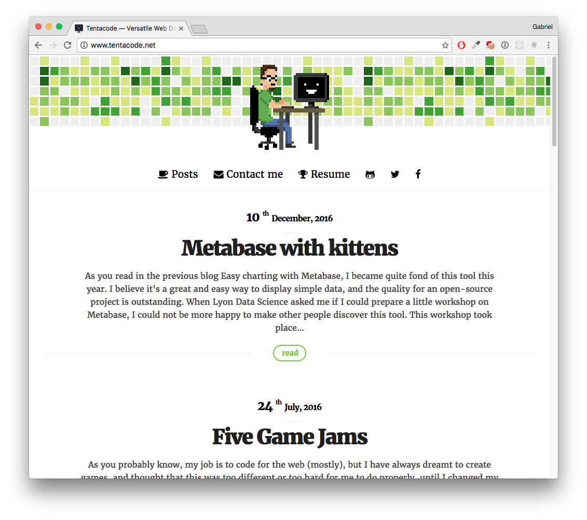

[ ](https://www.codeship.io/projects/34273) [](https://scrutinizer-ci.com/g/tentacode/tentacode-blog/?branch=master) [](https://scrutinizer-ci.com/g/tentacode/tentacode-blog/build-status/master)

# Tentacode.net

Oh hi. It's the code of [my website](http://tentacode.net).



## Run it

You need php >= 5.5 and node.

If you want to run it yourself, it's as simple as :

```
composer install
npm install
grunt
```

`php -S localhost:1337 -t web`

Blog should be available at [http://localhost:1337/app.php](http://localhost:1337/app.php)
